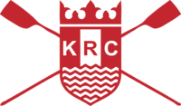

1

<!---->

<!--test-->

 Kingston Regatta has been contested on the river at Kingston upon Thames since 1857 and the Committee and Sponsors are pleased to continue this superb tradition

<h2>12 &amp; 13 July 2025</h2>
<h2>320 races from 8.30 am to 6.30 pm each day</h2>

<h3><a href="/results">Results from previous years</a></h3>		

  
Kingston Regatta has long been run from Kingston Rowing Club.

  
  
For information on rowing in Kingston, Kingston Eights Head and Kingston Small Boats Head visit the <a href="https://www.kingstonrc.co.uk">Kingston Rowing Club website</a>.

